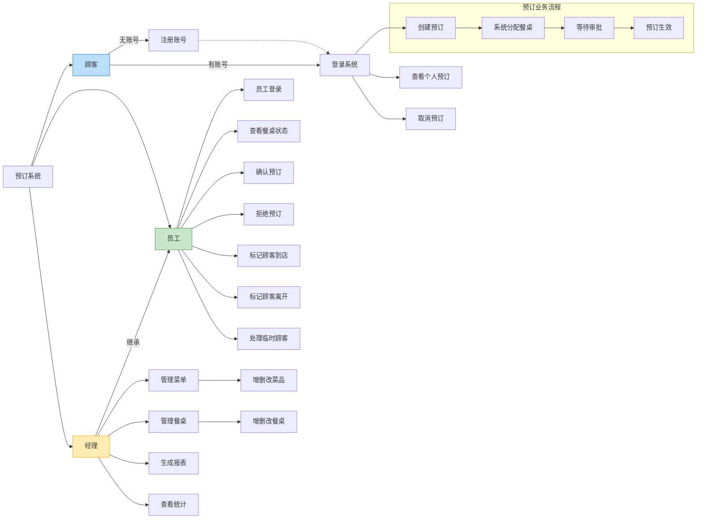

```mermaid
graph LR
    %% 参与者定义
    A[顾客]
    B[员工]
    C[经理]
    D[预订系统]

    %% 顾客用例
    A -->|无账号| U1[注册账号]
    U1-..->U2
    A -->|有账号| U2[登录系统]
    U2 --> U3[创建预订]
    U2 --> U4[查看个人预订]
    U2 --> U5[取消预订]

    %% 员工用例
    B --> U6[员工登录]
    B --> U7[查看餐桌状态]
    B --> U8[确认预订]
    B --> U9[拒绝预订]
    B --> U10[标记顾客到店]
    B --> U11[标记顾客离开]
    B --> U12[处理临时顾客]

    %% 经理用例（继承员工）
    C -->|继承|B
    C --> U13[管理菜单]
    U13 --> U18[增删改菜品]
    C --> U14[管理餐桌]
    U14 --> U19[增删改餐桌]
    C--> U20[生成报表]
    C--> U21[查看统计]

 
   

    %% 用例间关系
    D-->A
    D-->B
    D-->C

    %% 样式定义
    style A fill:#bbdefb,stroke:#1976d2
    style B fill:#c8e6c9,stroke:#388e3c
    style C fill:#ffecb3,stroke:#ffa000

    subgraph 预订业务流程
        U3 --> U15[系统分配餐桌]
        U15 --> U16[等待审批]
        U16 --> U17[预订生效]
    end
```