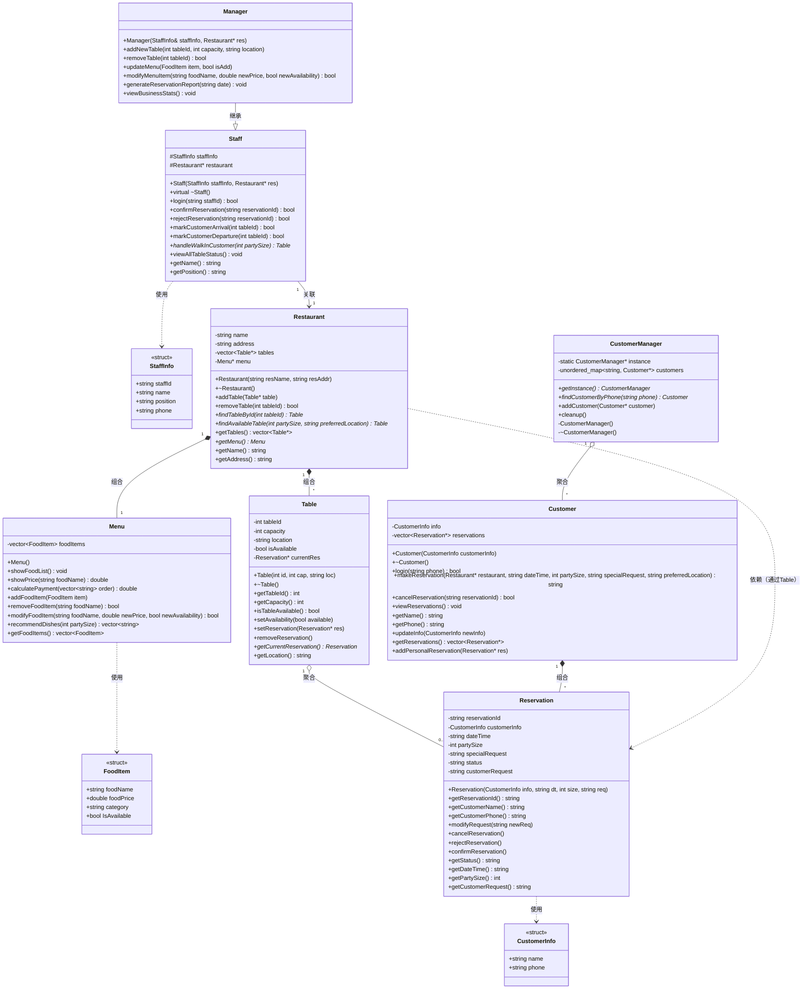

```mermaid
classDiagram
    direction TB
    
    %% 基础数据结构（非类，但作为类属性）
    class FoodItem {
        <<struct>>
        +string foodName
        +double foodPrice
        +string category
        +bool IsAvailable
    }
    
    class CustomerInfo {
        <<struct>>
        +string name
        +string phone
    }
    
    class StaffInfo {
        <<struct>>
        +string staffId
        +string name
        +string position
        +string phone
    }
    
    %% 核心业务类
    class Table {
        -int tableId
        -int capacity
        -string location
        -bool isAvailable
        -Reservation* currentRes
        +Table(int id, int cap, string loc)
        +~Table()
        +getTableId() int
        +getCapacity() int
        +isTableAvailable() bool
        +setAvailability(bool available)
        +setReservation(Reservation* res)
        +removeReservation()
        +getCurrentReservation() Reservation*
        +getLocation() string
    }
    
    class Reservation {
        -string reservationId
        -CustomerInfo customerInfo
        -string dateTime
        -int partySize
        -string specialRequest
        -string status
        -string customerRequest
        +Reservation(CustomerInfo info, string dt, int size, string req)
        +getReservationId() string
        +getCustomerName() string
        +getCustomerPhone() string
        +modifyRequest(string newReq)
        +cancelReservation()
        +rejectReservation()
        +confirmReservation()
        +getStatus() string
        +getDateTime() string
        +getPartySize() int
        +getCustomerRequest() string
    }
    
    class Menu {
        -vector~FoodItem~ foodItems
        +Menu()
        +showFoodList() void
        +showPrice(string foodName) double
        +calculatePayment(vector~string~ order) double
        +addFoodItem(FoodItem item)
        +removeFoodItem(string foodName) bool
        +modifyFoodItem(string foodName, double newPrice, bool newAvailability) bool
        +recommendDishes(int partySize) vector~string~
        +getFoodItems() vector~FoodItem~
    }
    
    class Restaurant {
        -string name
        -string address
        -vector~Table*~ tables
        -Menu* menu
        +Restaurant(string resName, string resAddr)
        +~Restaurant()
        +addTable(Table* table)
        +removeTable(int tableId) bool
        +findTableById(int tableId) Table*
        +findAvailableTable(int partySize, string preferredLocation) Table*
        +getTables() vector~Table*~
        +getMenu() Menu*
        +getName() string
        +getAddress() string
    }
    
    class Customer {
        -CustomerInfo info
        -vector~Reservation*~ reservations
        +Customer(CustomerInfo customerInfo)
        +~Customer()
        +login(string phone) bool
        +makeReservation(Restaurant* restaurant, string dateTime, int partySize, string specialRequest, string preferredLocation) string
        +cancelReservation(string reservationId) bool
        +viewReservations() void
        +getName() string
        +getPhone() string
        +updateInfo(CustomerInfo newInfo)
        +getReservations() vector~Reservation*~
        +addPersonalReservation(Reservation* res)
    }
    
    class Staff {
        #StaffInfo staffInfo
        #Restaurant* restaurant
        +Staff(StaffInfo staffInfo, Restaurant* res)
        +virtual ~Staff()
        +login(string staffId) bool
        +confirmReservation(string reservationId) bool
        +rejectReservation(string reservationId) bool
        +markCustomerArrival(int tableId) bool
        +markCustomerDeparture(int tableId) bool
        +handleWalkInCustomer(int partySize) Table*
        +viewAllTableStatus() void
        +getName() string
        +getPosition() string
    }
    
    class Manager {
        +Manager(StaffInfo& staffInfo, Restaurant* res)
        +addNewTable(int tableId, int capacity, string location)
        +removeTable(int tableId) bool
        +updateMenu(FoodItem item, bool isAdd)
        +modifyMenuItem(string foodName, double newPrice, bool newAvailability) bool
        +generateReservationReport(string date) void
        +viewBusinessStats() void
    }
    
    class CustomerManager {
        -static CustomerManager* instance
        -unordered_map~string, Customer*~ customers
        +getInstance() CustomerManager*
        +findCustomerByPhone(string phone) Customer*
        +addCustomer(Customer* customer)
        +cleanup()
        -CustomerManager()
        -~CustomerManager()
    }
    
    %% 关系定义
    Manager --|> Staff : 继承
    
    Restaurant "1" *-- "*" Table : 组合
   
    
    Restaurant "1" *-- "1" Menu : 组合
    
    
    Table "1" o-- "0..1" Reservation : 聚合

    
    Customer "1" *-- "*" Reservation : 组合

    
    Staff "1" --> "1" Restaurant : 关联

    
    CustomerManager "1" o-- "*" Customer : 聚合

    
    %% 依赖关系（数据依赖）
    Reservation ..> CustomerInfo : 使用
    Menu ..> FoodItem : 使用
    Staff ..> StaffInfo : 使用
    Restaurant ..> Reservation : 依赖（通过Table）
    
```