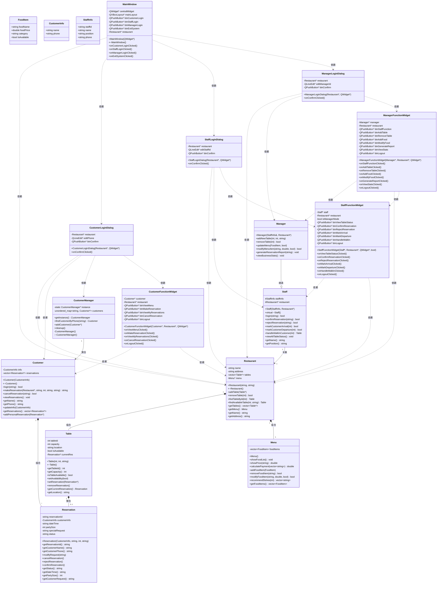

```mermaid
classDiagram
    %% 基础数据结构
    class FoodItem {
        +string foodName
        +double foodPrice
        +string category
        +bool IsAvailable
    }
    
    class CustomerInfo {
        +string name
        +string phone
    }
    
    class StaffInfo {
        +string staffId
        +string name
        +string position
        +string phone
    }

    %% 核心业务类
    class Table {
        -int tableId
        -int capacity
        -string location
        -bool isAvailable
        -Reservation* currentRes
        +Table(int, int, string)
        +~Table()
        +getTableId() int
        +getCapacity() int
        +isTableAvailable() bool
        +setAvailability(bool)
        +setReservation(Reservation*)
        +removeReservation()
        +getCurrentReservation() Reservation*
        +getLocation() string
    }
    
    class Reservation {
        -string reservationId
        -CustomerInfo customerInfo
        -string dateTime
        -int partySize
        -string specialRequest
        -string status
        +Reservation(CustomerInfo, string, int, string)
        +getReservationId() string
        +getCustomerName() string
        +getCustomerPhone() string
        +modifyRequest(string)
        +cancelReservation()
        +rejectReservation()
        +confirmReservation()
        +getStatus() string
        +getDateTime() string
        +getPartySize() int
        +getCustomerRequest() string
    }
    
    class Menu {
        -vector~FoodItem~ foodItems
        +Menu()
        +showFoodList() void
        +showPrice(string) double
        +calculatePayment(vector~string~) double
        +addFoodItem(FoodItem)
        +removeFoodItem(string) bool
        +modifyFoodItem(string, double, bool) bool
        +recommendDishes(int) vector~string~
        +getFoodItems() vector~FoodItem~
    }
    
    class Restaurant {
        -string name
        -string address
        -vector~Table*~ tables
        -Menu* menu
        +Restaurant(string, string)
        +~Restaurant()
        +addTable(Table*)
        +removeTable(int) bool
        +findTableById(int) Table*
        +findAvailableTable(int, string) Table*
        +getTables() vector~Table*~
        +getMenu() Menu*
        +getName() string
        +getAddress() string
    }
    
    %% 用户类
    class Customer {
        -CustomerInfo info
        -vector~Reservation*~ reservations
        +Customer(CustomerInfo)
        +~Customer()
        +login(string) bool
        +makeReservation(Restaurant*, string, int, string, string) string
        +cancelReservation(string) bool
        +viewReservations() void
        +getName() string
        +getPhone() string
        +updateInfo(CustomerInfo)
        +getReservations() vector~Reservation*~
        +addPersonalReservation(Reservation*)
    }
    
    class Staff {
        #StaffInfo staffInfo
        #Restaurant* restaurant
        +Staff(StaffInfo, Restaurant*)
        +virtual ~Staff()
        +login(string) bool
        +confirmReservation(string) bool
        +rejectReservation(string) bool
        +markCustomerArrival(int) bool
        +markCustomerDeparture(int) bool
        +handleWalkInCustomer(int) Table*
        +viewAllTableStatus() void
        +getName() string
        +getPosition() string
    }
    
    class Manager {
        +Manager(StaffInfo&, Restaurant*)
        +addNewTable(int, int, string)
        +removeTable(int) bool
        +updateMenu(FoodItem, bool)
        +modifyMenuItem(string, double, bool) bool
        +generateReservationReport(string) void
        +viewBusinessStats() void
    }
    
    class CustomerManager {
        -static CustomerManager* instance
        -unordered_map~string, Customer*~ customers
        +getInstance() CustomerManager*
        +findCustomerByPhone(string) Customer*
        +addCustomer(Customer*)
        +cleanup()
        -CustomerManager()
        -~CustomerManager()
    }
    
    %% Qt界面类
    class MainWindow {
        -QWidget* centralWidget
        -QVBoxLayout* mainLayout
        -QPushButton* btnCustomerLogin
        -QPushButton* btnStaffLogin
        -QPushButton* btnManagerLogin
        -QPushButton* btnExitSystem
        -Restaurant* restaurant
        +MainWindow(QWidget*)
        +~MainWindow()
        +onCustomerLoginClicked()
        +onStaffLoginClicked()
        +onManagerLoginClicked()
        +onExitSystemClicked()
    }
    
    class CustomerLoginDialog {
        -Restaurant* restaurant
        -QLineEdit* editPhone
        -QPushButton* btnConfirm
        +CustomerLoginDialog(Restaurant*, QWidget*)
        +onConfirmClicked()
    }
    
    class CustomerFunctionWidget {
        -Customer* customer
        -Restaurant* restaurant
        -QPushButton* btnViewMenu
        -QPushButton* btnMakeReservation
        -QPushButton* btnViewMyReservations
        -QPushButton* btnCancelReservation
        -QPushButton* btnLogout
        +CustomerFunctionWidget(Customer*, Restaurant*, QWidget*)
        +onViewMenuClicked()
        +onMakeReservationClicked()
        +onViewMyReservationsClicked()
        +onCancelReservationClicked()
        +onLogoutClicked()
    }
    
    class StaffLoginDialog {
        -Restaurant* restaurant
        -QLineEdit* editStaffId
        -QPushButton* btnConfirm
        +StaffLoginDialog(Restaurant*, QWidget*)
        +onConfirmClicked()
    }
    
    class StaffFunctionWidget {
        -Staff* staff
        -Restaurant* restaurant
        -bool isManagerMode
        -QPushButton* btnViewTableStatus
        -QPushButton* btnConfirmReservation
        -QPushButton* btnRejectReservation
        -QPushButton* btnMarkArrival
        -QPushButton* btnMarkDeparture
        -QPushButton* btnHandleWalkIn
        -QPushButton* btnLogout
        +StaffFunctionWidget(Staff*, Restaurant*, QWidget*, bool)
        +onViewTableStatusClicked()
        +onConfirmReservationClicked()
        +onRejectReservationClicked()
        +onMarkArrivalClicked()
        +onMarkDepartureClicked()
        +onHandleWalkInClicked()
        +onLogoutClicked()
    }
    
    class ManagerLoginDialog {
        -Restaurant* restaurant
        -QLineEdit* editManagerId
        -QPushButton* btnConfirm
        +ManagerLoginDialog(Restaurant*, QWidget*)
        +onConfirmClicked()
    }
    
    class ManagerFunctionWidget {
        -Manager* manager
        -Restaurant* restaurant
        -QPushButton* btnStaffFunction
        -QPushButton* btnAddTable
        -QPushButton* btnRemoveTable
        -QPushButton* btnAddFood
        -QPushButton* btnModifyFood
        -QPushButton* btnGenerateReport
        -QPushButton* btnViewStats
        -QPushButton* btnLogout
        +ManagerFunctionWidget(Manager*, Restaurant*, QWidget*)
        +onStaffFunctionClicked()
        +onAddTableClicked()
        +onRemoveTableClicked()
        +onAddFoodClicked()
        +onModifyFoodClicked()
        +onGenerateReportClicked()
        +onViewStatsClicked()
        +onLogoutClicked()
    }
    
    %% 关系定义
    Manager --|> Staff : 继承
    Restaurant "1" *-- "*" Table : 组合
    Restaurant "1" *-- "1" Menu : 组合
    Table "1" *-- "0..1" Reservation : 聚合
    Customer "1" *-- "*" Reservation : 组合
    Staff "1" --> "1" Restaurant : 关联
    CustomerManager "1" --> "*" Customer : 聚合
    
    %% 依赖关系
    MainWindow ..> Restaurant : 依赖
    MainWindow ..> CustomerLoginDialog : 依赖
    MainWindow ..> StaffLoginDialog : 依赖
    MainWindow ..> ManagerLoginDialog : 依赖
    
    CustomerLoginDialog ..> Restaurant : 依赖
    CustomerLoginDialog ..> Customer : 依赖
    CustomerLoginDialog ..> CustomerManager : 依赖
    CustomerLoginDialog ..> CustomerFunctionWidget : 依赖
    
    CustomerFunctionWidget ..> Customer : 依赖
    CustomerFunctionWidget ..> Restaurant : 依赖
    
    StaffLoginDialog ..> Restaurant : 依赖
    StaffLoginDialog ..> Staff : 依赖
    StaffLoginDialog ..> StaffFunctionWidget : 依赖
    
    StaffFunctionWidget ..> Staff : 依赖
    StaffFunctionWidget ..> Restaurant : 依赖
    
    ManagerLoginDialog ..> Restaurant : 依赖
    ManagerLoginDialog ..> Manager : 依赖
    ManagerLoginDialog ..> ManagerFunctionWidget : 依赖
    
    ManagerFunctionWidget ..> Manager : 依赖
    ManagerFunctionWidget ..> Restaurant : 依赖
    ManagerFunctionWidget ..> StaffFunctionWidget : 依赖
```